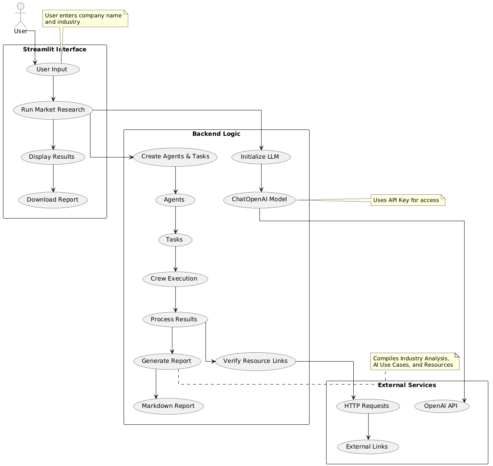

# AI Use Case Generator

## Overview

The AI Use Case Generator is a multi-agent system that analyzes companies and generates tailored AI implementation recommendations. It uses CrewAI framework to orchestrate multiple AI agents that work together to provide comprehensive analysis and actionable insights.

## Features

- Industry and company analysis
- AI use case generation
- Resource and dataset recommendations
- Interactive web interface
- Exportable reports

## Architecture



## Installation

1. Clone the repository:

```bash
git clone https://github.com/Yashvi30/AI_Use_Case_Generator.git
cd ai-use-case-generator
```

2. Install dependencies:

```bash
pip install -r requirements.txt
```

3. Configure environment variables:

```bash
cp config/.env.example config/.env
# Edit .env with your API keys
```

4. Run the application:

```bash
streamlit run src/main.py
```

```

```
